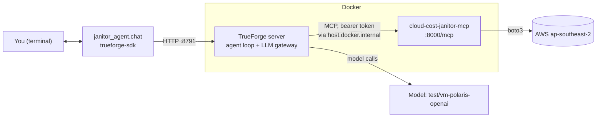

# truefoundry-agent

A **Cloud Cost Janitor** agent for a locally running TrueForge
(Docker Compose, `~/trueforge`). It uses the MCP server in [`../mcp-s2sep`](../mcp-s2sep) to
inventory AWS, find idle resources, and — only after you approve — delete them.



TrueForge runs the agent loop (model calls, tool calls, approvals). This repo
only holds the agent **definition** and two small clients:

| File | Role |
| --- | --- |
| `janitor_agent/spec.py` | The agent: model, instructions, attached MCP server, approval gate. |
| `janitor_agent/register.py` | Idempotently registers the MCP server as a TrueForge connector (with its bearer token) and creates/updates the agent. |
| `janitor_agent/chat.py` | Terminal chat: streams replies, shows tool calls/results, and **pauses for your approval** on gated tools. |
| `janitor_agent/__main__.py` | Single entrypoint (`register` / `check` / `chat`), used by the Docker image. |
| `janitor_agent/config.py` | Settings from env / `.env`; defaults follow `../mcp-s2sep`. |

## Quick start

Prerequisites: TrueForge running (`docker ps` shows `trueforge-server-1`) and
the MCP server running (`../mcp-s2sep/scripts/deploy_local.sh up`).

```bash
python3 -m venv .venv && source .venv/bin/activate
pip install -r requirements-dev.txt
cp .env.example .env              # optional: defaults work with the local setup

python -m janitor_agent.register  # once, and again whenever spec.py changes
python -m janitor_agent.chat      # interactive
python -m janitor_agent.chat "What do I have in AWS?"   # one message
```

`register` also proves the wiring: it asks TrueForge (from inside Docker) to
list the MCP server's tools and fails if `list_resources`,
`analyze_infrastructure` or `execute_teardown` are missing.

## Running with Docker

The image is a small non-root Python container holding the same three commands
(`register`, `check`, `chat`) behind one entrypoint. No credentials are baked in.

```bash
docker compose run --rm register     # once, and after changing spec.py or rotating the token
docker compose run --rm check        # smoke test: TrueForge up, agent registered, MCP tools reachable
docker compose run --rm chat         # interactive; approval prompts appear in your terminal
docker compose run --rm chat --fresh "What do I have in AWS?"
```

Or without compose: `docker build -t cloud-cost-janitor-agent .` then
`docker run --rm -it -e MCP_AUTH_TOKEN=... cloud-cost-janitor-agent chat`.

How it is wired:

- The container reaches TrueForge at `http://host.docker.internal:8791` (host
  port of the compose-run TrueForge); `extra_hosts: host-gateway` makes that
  name work on Linux too.
- `MCP_URL` is resolved by the **TrueForge server container**, not this one, so
  it stays `http://host.docker.internal:8000/mcp`.
- The MCP bearer token is mounted as a secret from `../mcp-s2sep/.mcp_token`
  (override with `MCP_TOKEN_FILE`, or pass `MCP_AUTH_TOKEN` / `MCP_AUTH_TOKEN_FILE`).
- Settings come from the shell or `.env` (`AWS_REGION`, `AGENT_MODEL`,
  `TRUEFORGE_BASE_URL`, `TRUEFORGE_TOKEN`, `FRESH_SESSION_PER_MESSAGE`).
- With no terminal (`-T`, CI, cron) nobody can answer an approval prompt, so
  every gated call is **denied**. Deletion always needs an interactive human.

This is a CLI client, not a server: nothing here listens on a port. TrueForge
runs the agent loop; the container only registers the agent and drives sessions.

## Using it from your own code

```python
from janitor_agent import chat, config

client = config.make_client()
session = client.sessions.create(agent={"name": "cloud-cost-janitor"})
chat.converse(client, session.data.id, "Find idle resources")   # handles approvals for you
```

or the plain SDK shape:

```python
from trueforge_sdk import TrueForge

client = TrueForge(base_url="http://localhost:8791")
session = client.sessions.create(agent={"name": "cloud-cost-janitor"})
for event in client.sessions.create_turn_stream(
    session_id=session.data.id,
    input=[{"type": "user.message", "content": "Hello!"}],
):
    print(event)
```

## Cost estimates

Costs come from the MCP server's price table (`../mcp-s2sep/PRICING.md`:
EBS gp3/gp2/io1 per GB-month, idle ALB base rate, stopped instances = their
attached EBS), computed **in code, not by the LLM**.

- **Idle/flagged resources:** the scan returns `estimated_monthly_cost_usd` per
  resource plus a `cost_summary`; the agent shows them in a table with the total.
- **Before you delete:** the agent restates the cost of exactly the resources it
  will delete, and the **approval prompt itself** prints per-resource cost and
  the total monthly savings, built from the raw scan output, so it is shown even
  if the model forgets:
  ```
  === APPROVAL REQUIRED: execute_teardown ===
  This PERMANENTLY deletes the listed AWS resources.
  What deleting these would save:
   vol-0abc old-data: $8.00/month
   i-0def web: $0.80/month
   Estimated monthly savings: $8.80
   (estimate from PRICING.md us-east-1 list-price rates, not live AWS billing)
  Approve? [y/N]
  ```
- **After the delete:** savings for only the resources actually deleted.
- **Unpriced parts** (other EBS types, non-application load balancers, compute
  of *running* instances, which has no rate in the table) are labelled, and
  totals say "at least". They are never guessed. Rates are us-east-1 list-price
  approximations while your account is in ap-southeast-2, so treat figures as
  estimates.

## Safety: how deletion is gated

Three independent layers, so no single failure deletes something:

1. **Human approval in TrueForge** — `execute_teardown` is listed by name in
   `require_approval_for_tools`, so the turn pauses and `chat.py` asks you
   `Approve? [y/N]` (default **deny**). It is named explicitly on purpose: the
   `@destructive` selector relies on MCP tool annotations that the server does
   not publish, so it would let the tool run ungated.
2. **The agent's instructions** — only delete ids copied from
   `analyze_infrastructure`, never invent ids, and stop on a rejection.
3. **The MCP server's own guardrails** — provenance (only ids from a scan in
   this session), `hackathon-demo=true` tag fence, re-verification, 10-id cap,
   kill switch. See `../mcp-s2sep/README.md`.

## Always-fresh answers (no reusing earlier results)

TrueForge does not cache tool *results* (it only caches tool schemas). Repeat
answers come from the conversation itself: in one session the model can see the
earlier tool output and answer from it. Two controls:

| Control | How | Trade-off |
| --- | --- | --- |
| **Instruction (default)** | The agent's instructions mark anything already in the conversation as stale and require a tool call for every AWS question, plus a fresh `analyze_infrastructure` right before any teardown. | Enforced by the model, so weaker models could still slip. |
| **Fresh session per message** | `python -m janitor_agent.chat --fresh`, or `FRESH_SESSION_PER_MESSAGE=true` | Guaranteed: the model has no earlier results in context. No follow-ups across messages (e.g. "delete those" after a listing). |

Verified: the same question asked 3 times produced 3 MCP `list_resources` calls
in both modes. The hard backstop is server-side either way: `execute_teardown`
only accepts ids from a scan in that MCP process and re-verifies each resource
against AWS right before deleting, so stale data can never cause a delete.
When embedding the agent in your own code, call `client.sessions.create(...)`
per request for the same strict behaviour.

## Configuration

| Variable | Default | Purpose |
| --- | --- | --- |
| `TRUEFORGE_BASE_URL` | `http://localhost:8791` | TrueForge API. The compose file maps container port 8790 to **host 8791**; use 8790 only if you run TrueForge from source (`pnpm dev`). |
| `TRUEFORGE_TOKEN` | unset | Only when OIDC login is enabled. |
| `FRESH_SESSION_PER_MESSAGE` | off | New session per message (see above). |
| `AGENT_MODEL` | `test/vm-polaris-openai` | Any model from `GET /api/v1/models`. |
| `MCP_URL` | `http://host.docker.internal:8000/mcp` | The MCP server **as seen from the TrueForge container** (`localhost` there is the container itself). |
| `MCP_AUTH_TOKEN` / `MCP_AUTH_TOKEN_FILE` | `../mcp-s2sep/.mcp_token` | Bearer token TrueForge presents to the MCP server. |
| `AWS_REGION` | from `../mcp-s2sep/.env` | Region the agent is told to use (the MCP server rejects any other). |

## Notes and limits

- The MCP token is stored in TrueForge's connector settings (responses are
  redacted). Re-run `register` after rotating it.
- Quality depends on the model you pick: the tiny local `qwen3-4b` (4k
  context) is too small for tool-heavy turns; use a larger one.
- Approvals are interactive by design; there is no auto-approve flag.

## Tests

```bash
pytest tests/     # offline: agent spec, approval/pause handling
```
